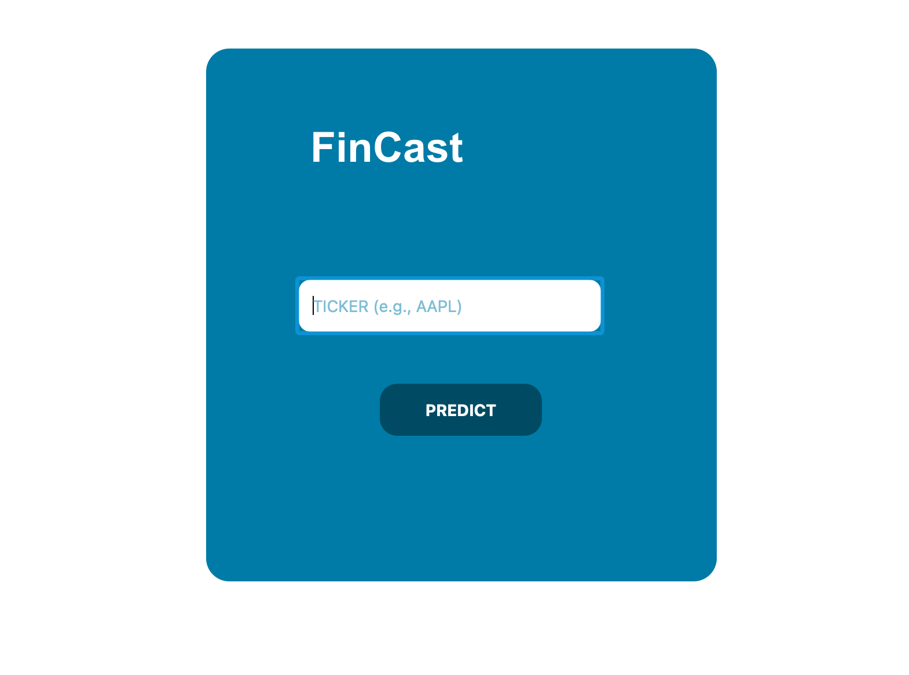
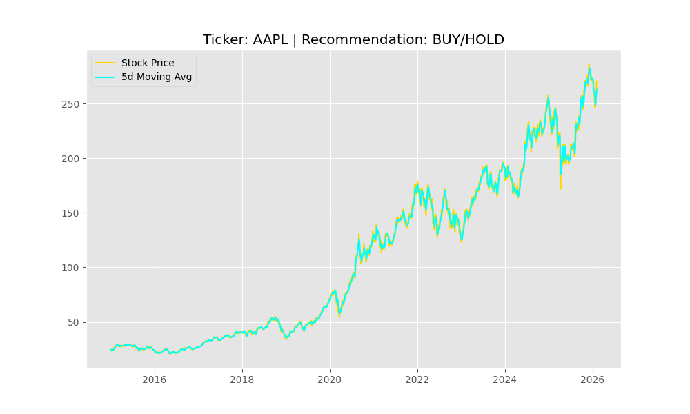

# FinCast Stock Predictor 📈

FinCast is a custom-styled desktop application built with Python and PyQt5. It helps users visualize stock market trends and provides a simple "Buy/Hold" or "Sell" recommendation based on a 5-day Moving Average (MA) crossover strategy.

## 🎨 Features
- **Modern UI**: A clean, white-and-blue interface with rounded corners.
- **Real-time Data**: Fetches the latest market prices using the `yfinance` API.
- **Interactive Charts**: Custom Matplotlib integration allowing users to zoom, pan, and save stock graphs.
- **Trend Analysis**: Uses a 5-day Moving Average to identify potential market momentum.

## 🛠️ Technology Stack
- **Language**: Python 3.9+
- **GUI Framework**: PyQt5
- **Data Analysis**: Pandas, Matplotlib
- **API**: Yahoo Finance (`yfinance`)

